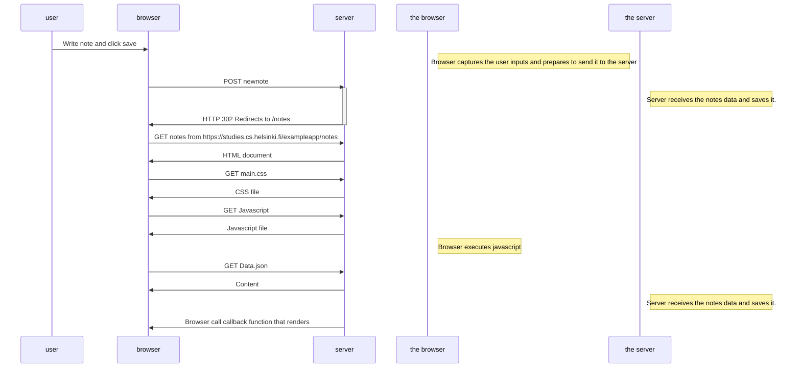

```mermaid
sequenceDiagram
    participant user
    participant browser
    participant server

    user ->> browser: Write note and click save
    Note right of the browser: Browser captures the user inputs and prepares to send it to the server

    browser->> server: POST newnote

    activate server
    Note right of the server: Server receives the notes data and saves it.
    server->> browser: HTTP 302 Redirects to /notes
    deactivate server

    browser->>server: GET notes from https://studies.cs.helsinki.fi/exampleapp/notes
    

    server->> browser : HTML document

    browser->> server: GET main.css

    server->> browser: CSS file

    browser->> server:GET Javascript

    server->>browser: Javascript file 
    Note right of the browser: Browser executes javascript

    browser->>server: GET Data.json

    server->>browser: Content
    Note right of the server: Server receives the notes data and saves it.
    server->> browser: Browser call callback function that renders


    
```