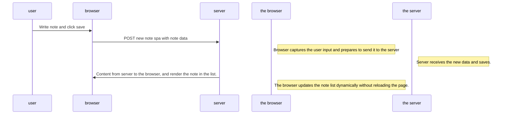

```mermaid
sequenceDiagram
    participant user
    participant browser
    participant server

    user->>browser: Write note and click save

    browser->>server: POST new note spa with note data
    Note right of the browser: Browser captures the user input and prepares to send it to the server

    Note right of the server: Server receives the new data and saves.

    server->>browser: Content from server to the browser, and render the note in the list.

    Note right of the browser: The browser updates the note list dynamically without reloading the page.


```