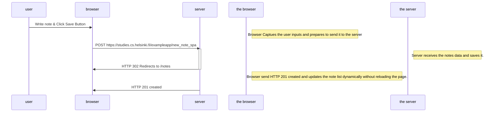

```mermaid
sequenceDiagram
    participant user
    participant browser
    participant server

    user->>browser: Write note & Click Save Button
    Note right of the browser: Browser Captues the user inputs and prepares to send it to the server

    browser->> server: POST https://studies.cs.helsinki.fi/exampleapp/new_note_spa
    activate server
    Note right of the server: Server receives the notes data and saves it.
    server->> browser: HTTP 302 Redirects to /notes
    deactivate server
    Note right of the browser: Browser send HTTP 201 created and updates the note list dynamically without reloading the page.

    server->>browser: HTTP 201 created
```